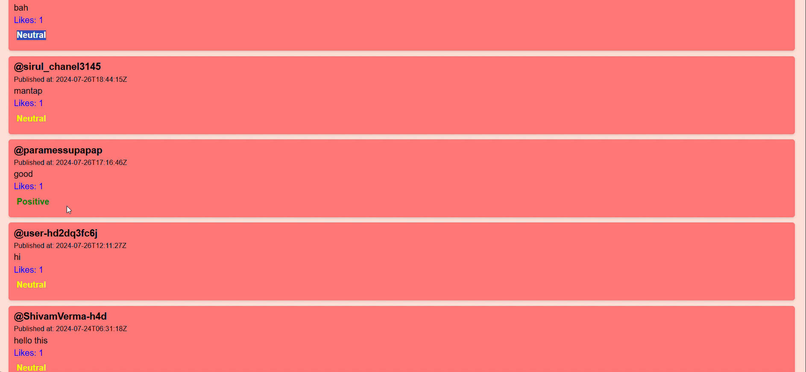

# 🎙️ TubeTalk Metrics

**TubeTalk Metrics** is a powerful web app that analyzes the **sentiment** of YouTube video comments using natural language processing. Simply paste a YouTube video URL, and get insights into how the audience is reacting — whether positively, negatively, or neutrally.

---

## 🚀 Features

- 🔗 Paste any **YouTube video URL**
- 💬 Fetch **top-level comments** using the YouTube Data API
- 🤖 Perform **Sentiment Analysis** on comments (Positive / Neutral / Negative)
- 📊 Display **summary statistics** and visualizations (charts, percentages)
- 🌐 Clean and simple web interface

---

## 🛠️ Tech Stack

### Frontend
- React.js / HTML / CSS (or whichever stack you used)
- Axios for API calls
- Chart.js or Recharts for sentiment visualization

### Backend
- Node.js with Express **OR** Python with Flask
- YouTube Data API (v3) for fetching comments
- NLP tools:
  - `TextBlob`, `VADER` (Python) or
  - `natural`, `Sentiment` npm packages (Node)

---
## 📸 Screenshots

> ScreenShots Of UI
)  
)


## 📦 Installation

### Prerequisites

- Node.js & npm OR Python 3.x & pip
- YouTube Data API key

### Clone the repository

```bash
git clone https://github.com/your-username/tubetalk-metrics.git
cd tubetalk-metrics
